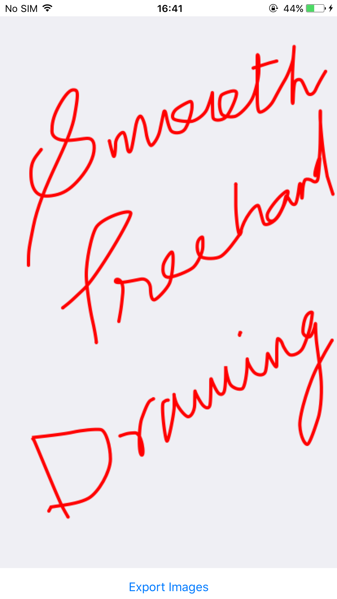
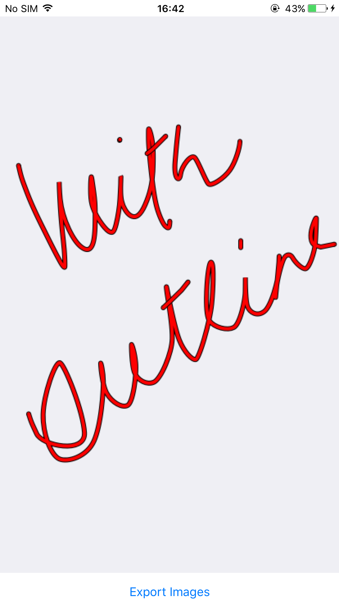
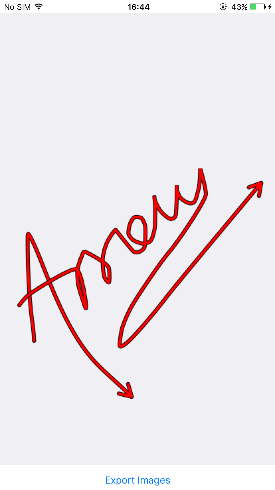
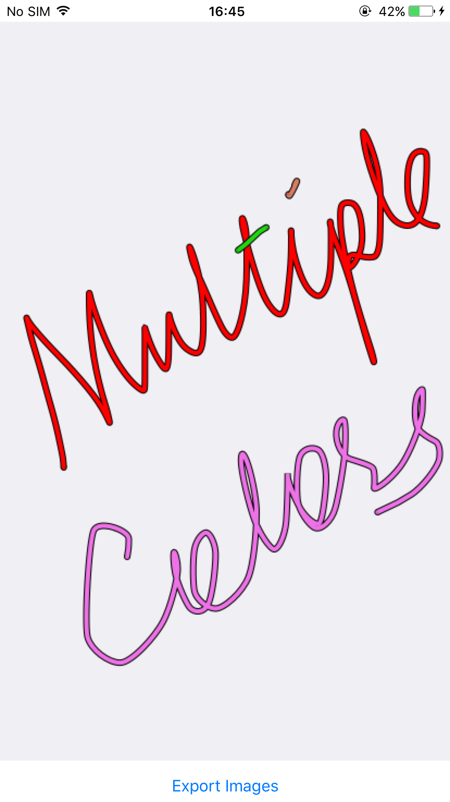
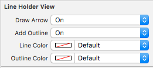

# LineHolderView
A Simple View in Swift 3 to add Free hand smooth drawing to your iOS Application.

## Freehand Drawing

## Add Outline

## Add Arrow Head

## Use Different Colours

## Implementation

* Copy the file LineHolderView.swift in your project.
* Add a view to your view controller in storyboard.
* Set the class of the view to LineHolderView.
* You're Done. Start drawing without a single line of code. :)

You can change the different properties directly from storyboard, No need to write code. :)

1. Enable/Disable Arrow Head.
2. Enable/Disable Outline.
3. Change Line colour.
4. Change Outline colour.

## Get Final Image

To get the final image just call the method `getFinalImage()` or `getFinalImage(background:)`, use later one if you want to add a background image to the drawing.

Enjoy.. :)
